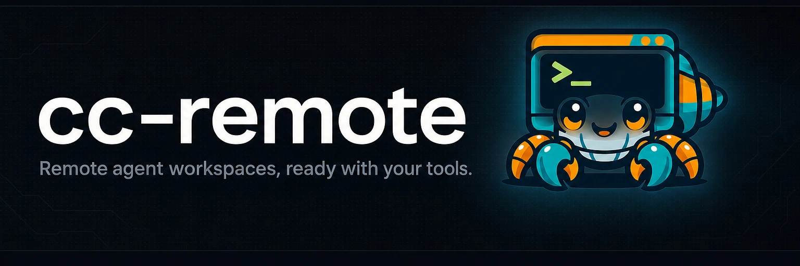

# 

**Remote agent workspaces, ready with your tools.**

[](https://github.com/yasyf/cc-remote/actions/workflows/ci.yml)
[](https://github.com/yasyf/cc-remote/blob/main/LICENSE)

cc-remote creates and manages remote workspaces where Claude Code and Codex run
against a repository checkout. Sprites and Namespace supply the machines; Orca
is the desktop frontend. Configuration selects the tools, plugins, checkout,
provider, and optional project setup commands.

Use Sprites over SSH for agent work. Prepare the tools and plugins, then fetch a
shallow checkout at the requested commit. Install project dependencies when the
task needs them. Opt into a separate Namespace profile for a full platform.

Tool preparation targets Linux. The Orca composer flow has source
and offline test coverage; its UI test and live personal-tailnet enrollment are
pending. Startup timings for this implementation have not been measured.

Follow [the Orca workspace guide](docs/orca-workspaces.md) to configure a
repository, preserve its budget history, and generate the environment recipes.
The [architecture](docs/architecture.md) describes preparation, identity, and
client ownership.

The [tool inventory reference](docs/tool-inventory.md) lists image, tool, plugin,
and service fields and the available image commands.

## Install

```bash
brew install --cask yasyf/tap/cc-remote
cc-remote version
```

Or build from source:

```bash
go install github.com/yasyf/cc-remote/cmd/cc-remote@latest
cc-remote version
```

Licensed under [PolyForm-Noncommercial-1.0.0](LICENSE).
