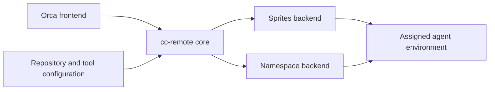

# Independent agent environments

An Orca workspace can use a small remote environment for editing code, then select
a different profile when its task needs a complete platform. The repository's
setup commands belong to that profile; the environment manager supplies the
host, checkout, tools, and lifecycle.

cc-remote implements this separation with Sprites and Namespace backends,
image, payload, and tool preparation, workspace lifecycle, and an Orca
adapter. The [workspace guide](orca-workspaces.md) describes the client setup.
The Orca composer flow and live personal-tailnet enrollment still need live
verification; startup timings for this implementation have not been measured.

## Separate the client from the host

A frontend translates a client's workspace request into a core request. A
backend performs the provider operations. The core coordinates the lifecycle
between them.

Orca is the current frontend. Sprites and Namespace are the current backends.
Claude Code and Codex run inside an assigned environment; their choice does not
change the provider lifecycle.

| Layer | Responsibility |
| --- | --- |
| Core | Lifecycle, checkout, tool readiness, identity, and ownership |
| Backend | Provider creation, execution, transport, wake, suspension or idle behavior, and deletion |
| Frontend | Client request mapping, result rendering, workspace registration, and client lifecycle events |
| Configuration | Repository settings, tool inventory, provider choices, and optional setup commands |

Client environment variables and result schemas belong to the frontend. Provider
commands and image choices belong to the backend. The core receives explicit
configuration and has no dependency on a particular repository or its build
infrastructure.

## Prepare tools and checkout

The lean profile selects Sprites over SSH with configured tools and plugins and
a shallow checkout of the requested ref. Project dependency installation and
platform startup are task-specific actions. A profile can supply those commands
when needed, including a full-stack Namespace environment.

Each create request provisions a fresh provider machine named for the workspace.
The selected image or [machine payload](tool-inventory.md#machine-payloads) can
supply tools; cc-remote reconciles them with the inventory and materializes the
requested checkout at the pinned source commit. A payload is a local file selected
by `path` and `sha256`, owned by the current user with no group or other
permissions. It requires an in-place machine with
`sprite-env` and cannot be combined with `image`.

Create streams the payload into the Sprite and checks both the file and any
existing mount's loop device against its SHA-256. It checks the manifest against
the tools fingerprint, home directory, architecture, and OS version, then exposes
the mounted trees. Any missing required tree fails creation.
Artifact directories and pinned marketplaces use links into the read-only mount;
plugin caches and configuration use writable copies. Before installing plugins
on create or resume with a payload, cc-remote merges the payload's `enabledPlugins`
into existing Claude settings, preserving every other user setting.
The `cc-remote-payload`
service checks stored payloads, or the loop devices behind existing mounts,
against their digests and remounts the files at boot, before dependent inventory
services.

Startup runs `provision.sh prerequisites` on machines provisioned in place, then
runs these lanes concurrently:

| Lane | Order |
| --- | --- |
| Packages | Run the remaining `apt-get` work and verify Debian artifacts on machines provisioned in place. |
| Checkout | Check out the pinned source commit, then run nonempty profile preparation after package and tool installation succeed. |
| Tools | Mount the payload when configured, provision system tools in place, install user tools and plugins, then wait for the packages lane before configuring and enrolling in the tailnet. |

Checkout overlaps installation; profile preparation and configuration start only
after both installs succeed. Create publishes the
[readiness stamp](tool-inventory.md#fingerprints-and-readiness) only after every
lane succeeds, then connects. Installation clears the stamp; the separate
`publish` phase writes it. Resume uses the stamp to check for changed tools,
images, or payloads.

| Part of the lean profile | Task-specific setup |
| --- | --- |
| Agent tools and plugins from the inventory | Repository dependency installation |
| Shallow checkout at the requested commit | Code generation and test workloads |
| SSH transport and client connection | Platform services and orchestration |

Installing an agent CLI prepares tools. A profile
that installs the repository's packages performs additional setup, even when the
repository is small. Calling both actions “bootstrap” obscures their different
costs and lifetimes.

## Give each environment its own identity

Images contain tool payloads, with no authenticated agent session, tailnet state,
or retained checkout credential. Each fresh workspace has its own host identity
and joins the configured tailnet.

`cc-remote payload build` installs the full inventory on a fresh build Sprite,
including private marketplaces. Its GitHub token reaches only the install phase's
stdin. Packing uses an explicit allowlist of installed tool trees and metadata;
owner sessions, credentials, plugin data, and SSH/tailnet state stay outside the
payload. The build streams the private file back, destroys the build Sprite, and
confirms its absence. It creates no workspace owner record or tailnet enrollment.

Cleanup uses the exact provider resource and recorded tailnet node. A retry
distinguishes a node it enrolled from one it reattached. A failed retry preserves
the existing node, and the resource lock covers reattachment, result delivery,
and any enrollment cleanup.

State belongs to `cc-remote` and records one workspace owner for each machine.
Create rejects a name that already has a workspace record; resume reconnects the
recorded workspace. Cleanup checks the provider's workspace ownership label
before deleting the machine. Agent environments use their own images,
independent of build infrastructure.

## Measure the complete startup path

Fresh provider creation, tool readiness, checkout readiness, SSH readiness, and
client registration are separate timestamps. Measure resume separately. A
completed test workload measures useful work after startup.

An SSH connection does not establish that the tools and checkout are ready.
Keeping those results separate makes the cost of each layer visible and prevents
installation or test time from being reported as provider startup.
